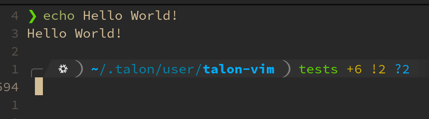

# Testing

See the [test folder](../test/) for implementation. Currently testing has only been verified to work on Linux.

## Setup

Modify the [settings file](../test/test_settings.talon) to set `user.talon_vim_enable_testing = true`. This will enable
to the voice commands to start and stop tests (see [Running](#Running)).

Depending on your terminal settings, you may have to set set `user.talon_vim_test_margin_lines = <number>`. If you have
a standard terminal, you likely don't need to modify it. However, if you have "fancy" terminal output, you will need
determine `<number>` you need to test the distance between a single line of echoed output, and your input prompt. For
example, see the output below:

Here, we see that `echo Hello World!` ends up having two addition lines after it's output. This means you would need
to set `user.talon_vim_test_margin_lines = 2`.

## Running

To start testing say `start vim tests`. The focused window must be a vim application. If you switch focus from this
window during testing the testing will automatically abort. If you want to prematurely aboard testing say `stop vim
tests`.

## Caveats

Talon will constantly worn about watchdogs while running the tests, which may be problematic once we have more and more.
